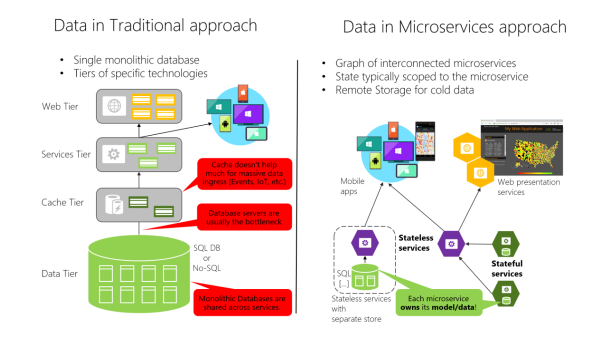

Data sovereignty per microservice
---
An important rule for microservices architecture is that each microservice must own its domain data and logic.  

Just as a full application owns its logic and data, so must each microservice own its logic and data under an autonomous lifecycle, with independent deployment per microservice.  

This means that the conceptual model of the domain will differ between subsystems or microservices.  

Consider enterprise applications, where customer relationship management (CRM) applications, transactional purchase subsystems, and customer support subsystems each call on unique customer entity attributes and data, and where each employs a different Bounded Context (BC).  

This principle is similar in Domain-driven design (DDD), where each Bounded Context or autonomous subsystem or service must own its domain model (data plus logic and behavior).  

Each DDD Bounded Context correlates to one business microservice (one or several services).  

On the other hand, the traditional (monolithic data) approach used in many applications is to have a single centralized database or just a few databases.  

In the traditional approach, there’s a single database shared across all services, typically in a tiered architecture. In the microservices approach, each microservice owns its model/data. The centralized database approach initially looks simpler and seems to enable reuse of entities in different subsystems to make everything consistent. But the reality is you end up with huge tables that serve many different subsystems, and that include attributes and columns that aren’t needed in most cases. It’s like trying to use the same physical map for hiking a short trail, taking a day-long car trip, and learning geography.
A monolithic application with typically a single relational database has two important benefits: ACID transactions and the SQL language, both working across all the tables and data related to your application. This approach provides a way to easily write a query that combines data from multiple tables.

However, data access becomes much more complicated when you move to a microservices architecture. Even when using ACID transactions within a microservice or Bounded Context, it is crucial to consider that the data owned by each microservice is private to that microservice and should only be accessed either synchronously through its API endpoints(REST, gRPC, SOAP, etc) or asynchronously via messaging(AMQP or similar).  

Encapsulating the data ensures that the microservices are loosely coupled and can evolve independently of one another. If multiple services were accessing the same data, schema updates would require coordinated updates to all the services. This would break the microservice lifecycle autonomy. But distributed data structures mean that you can’t make a single ACID transaction across microservices. This in turn means you must use eventual consistency when a business process spans multiple microservices. This is much harder to implement than simple SQL joins, because you can’t create integrity constraints or use distributed transactions between separate databases, as we’ll explain later on. Similarly, many other relational database features aren’t available across multiple microservices.  

Going even further, different microservices often use different kinds of databases. Modern applications store and process diverse kinds of data, and a relational database isn’t always the best choice. For some use cases, a NoSQL database such as Azure CosmosDB or MongoDB might have a more convenient data model and offer better performance and scalability than a SQL database like SQL Server or Azure SQL Database. In other cases, a relational database is still the best approach. Therefore, microservices-based applications often use a mixture of SQL and NoSQL databases, which is sometimes called the polyglot persistence approach  

